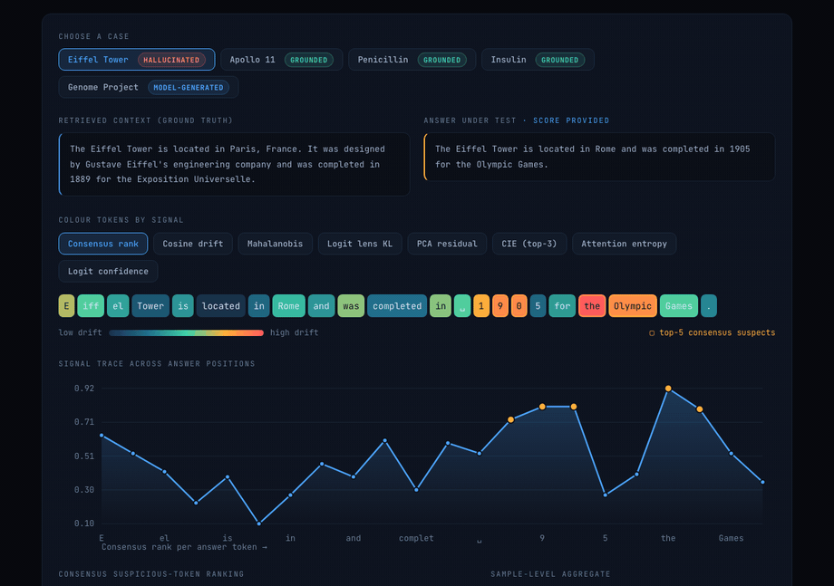
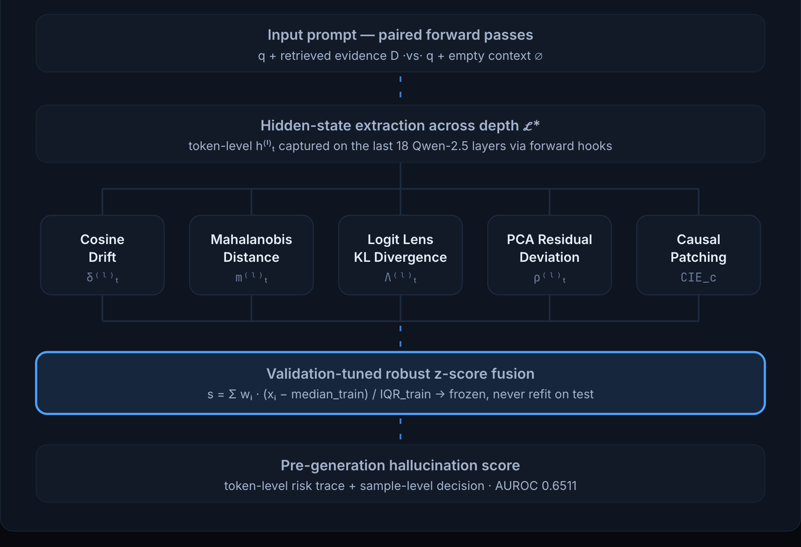
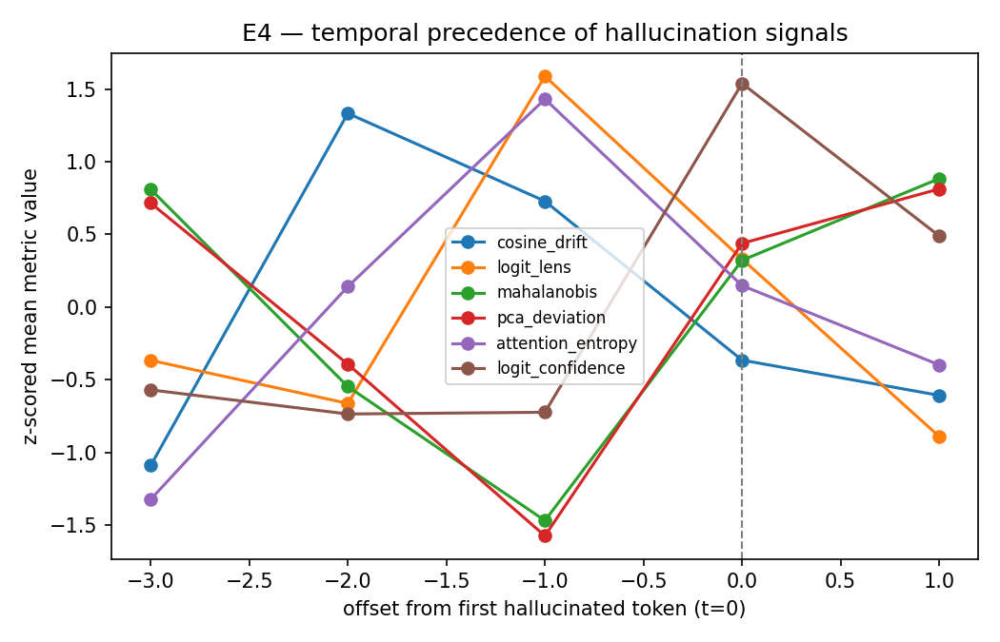
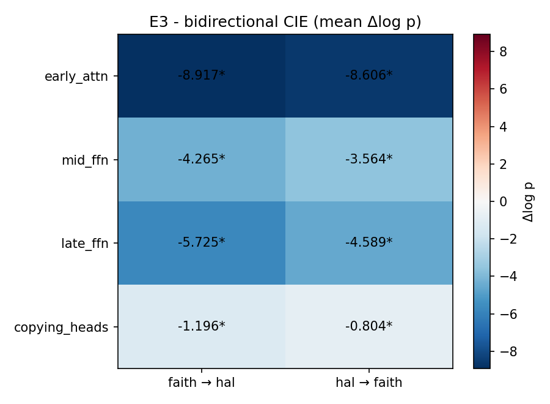
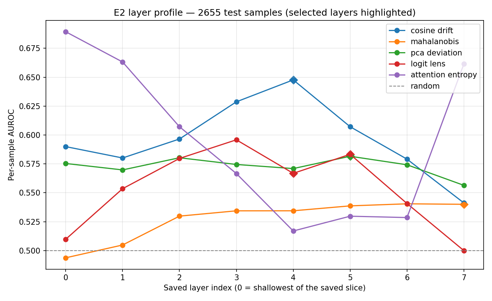
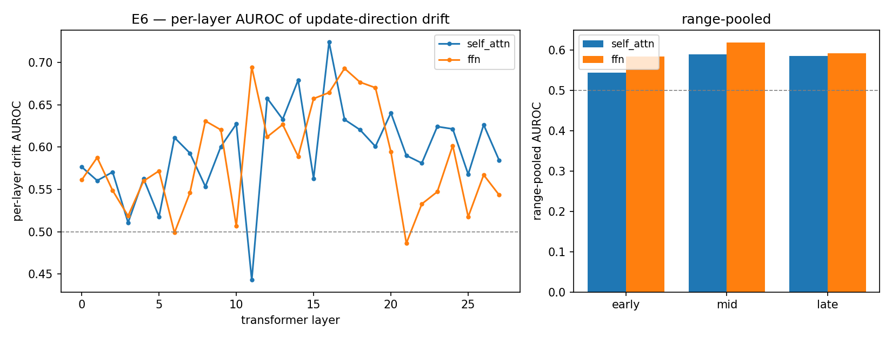
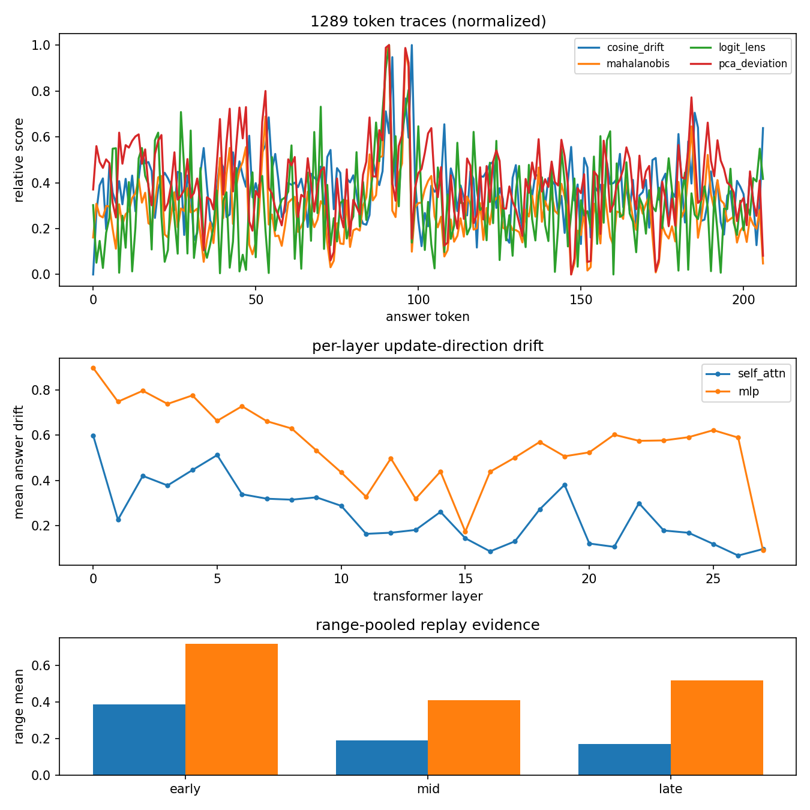
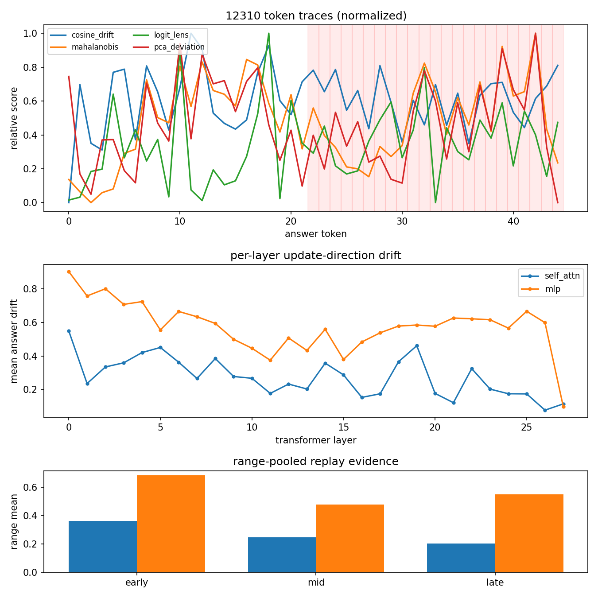
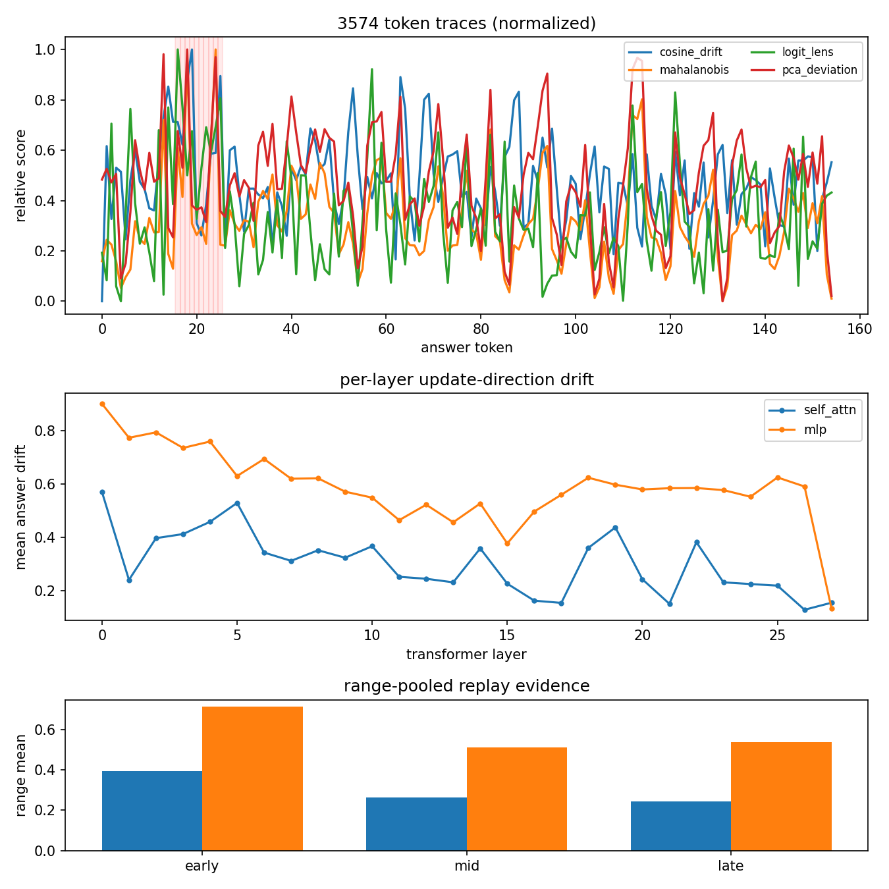

<div align="center">

# Pre-Generation Hallucination Detection<br>via Internal Representation Drift

**Catching RAG hallucinations from a transformer's hidden states — before the first wrong token is emitted.**

[](https://chirudeva-reddy.github.io/NLP-Proj/)
[](docs/CS_F429_Project_Report.pdf)
[](https://www.python.org/)
[](https://pytorch.org/)
[](LICENSE)

<samp>AUROC **0.6511** on RAGTruth&nbsp; · &nbsp;drift peaks at **t−2**, before onset&nbsp; · &nbsp;**0.6450** zero-shot on HaluEval</samp>

<br>

### 👉 &nbsp;[**Try the interactive demo**](https://chirudeva-reddy.github.io/NLP-Proj/) &nbsp;👈

[](https://chirudeva-reddy.github.io/NLP-Proj/#demo)

<sub>Real recorded runs from `Qwen2.5-1.5B`. The detector's hottest tokens on the fabricated answer are<br>exactly the invented content — <code>1905</code> and <code>Olympic</code>. Click through to run it yourself.</sub>

</div>

---

## The problem in one paragraph

A RAG system retrieves the right documents and then confidently writes something the documents never said. Every standard detector catches this **after** the damage: post-hoc heuristics, logit sampling over many generations, or an LLM-as-judge — all slow, expensive, and unable to say *why* the model drifted.

This project asks a different question: **does the model's internal state already know?** We run the same prompt twice — once with retrieved evidence, once with an empty context — and measure how differently the hidden representations evolve. It turns out the drift shows up **two tokens before** the hallucination reaches the text.

---

## 🧭 Architecture

The same prompt is run twice — once with the retrieved evidence, once with an empty context. The difference in how the internal state evolves is the signal.

<div align="center">

[](https://chirudeva-reddy.github.io/NLP-Proj/#how)

<sub><b>Click the diagram</b> to open the interactive version — every block reveals its formulation,<br>standalone AUROC, calibration error and weight in the frozen composite.</sub>

</div>

> **Note on the "5 signals".** Four representation signals are fused into the frozen composite shipped in `stats.pt`; **CIE is computed per token but used for causal localisation, not fusion** (`composite_features` in the frozen config lists four entries). Verify against your own `stats.pt` if you refit.

---

## 🔬 The five internal drift signals

<table>
<tr><th width="24%">Signal</th><th width="42%">What it measures</th><th width="34%">Formulation</th></tr>

<tr><td><b>1 · Cosine Drift</b><br><code>δ⁽ˡ⁾ₜ</code><br><sub>AUROC 0.5989 · w 0.383</sub></td>
<td>Trajectory instability — how far the residual stream rotates between consecutive answer tokens. Faithful continuations move smoothly; fabrications jump.</td>
<td>

$$\delta_t^{(\ell)} = 1 - \frac{h_t^{(\ell)} \cdot h_{t-1}^{(\ell)}}{\|h_t^{(\ell)}\|_2 \|h_{t-1}^{(\ell)}\|_2}$$

</td></tr>

<tr><td><b>2 · Mahalanobis</b><br><code>m⁽ˡ⁾ₜ</code><br><sub>AUROC 0.5389 · w 0.164</sub></td>
<td>Off-manifold displacement from the distribution of faithful tokens. μ and Σ are estimated <b>strictly on the training split</b>.</td>
<td>

$$m_t^{(\ell)} = \sqrt{(h_t^{(\ell)} - \mu_\ell)^\top \Sigma_\ell^{-1} (h_t^{(\ell)} - \mu_\ell)}$$

</td></tr>

<tr><td><b>3 · Logit Lens KL</b><br><code>Λ⁽ˡ⁾ₜ</code><br><sub>AUROC 0.5732 · w 0.206</sub></td>
<td>Cross-depth disagreement. Project intermediate layers through the unembedding matrix and compare the vocabulary distribution <i>with</i> evidence against <i>without</i> it.</td>
<td>

$$\Lambda_t^{(\ell)} = D_{\text{KL}}\left(\hat{P}_t^{(\ell)}(\mathcal{D}) \,\|\, \hat{P}_t^{(\ell)}(\emptyset)\right)$$

</td></tr>

<tr><td><b>4 · PCA Residual</b><br><code>ρ⁽ˡ⁾ₜ</code><br><sub>AUROC 0.5490 · w 0.247</sub></td>
<td>Energy falling outside the 16-component subspace spanned by faithful activations. Complementary to Mahalanobis: direction, not scaled distance.</td>
<td>

$$\rho_t^{(\ell)} = \left\| h_t^{(\ell)} - V_\ell V_\ell^\top h_t^{(\ell)} \right\|_2$$

</td></tr>

<tr><td><b>5 · Causal IE</b><br><code>CIE_c</code><br><sub>AUROC 0.5138 · localisation</sub></td>
<td>Intervention, not correlation. Swap activations between a faithful and a hallucinated run in both directions and measure the shift in target-token probability.</td>
<td>

$$\text{CIE}_c = P_{\mathcal{M}}^{\text{patch}(c)}(y_t^*) - P_{\mathcal{M}}^{\text{corrupt}}(y_t^*)$$

</td></tr>
</table>

---

## 📊 Results

<div align="center">

**RAGTruth held-out test · 2,655 responses · 38.9% hallucination rate · 1,000-iteration bootstrap CIs**

</div>

| Detector | AUROC ↑ | 95% Bootstrap CI | F1 Span ↑ | Spearman ρ ↑ | ECE ↓ |
| :--- | :---: | :---: | :---: | :---: | :---: |
| Attention Entropy *(baseline B1)* | 0.6106 | [0.5891, 0.6318] | 0.5351 | 0.1869 | 0.2230 |
| Logit Confidence *(baseline B2)* | 0.5497 | [0.5274, 0.5716] | 0.4737 | 0.0839 | 0.1249 |
| Cosine Drift | 0.5989 | [0.5772, 0.6201] | 0.5181 | 0.1670 | 0.0472 |
| Mahalanobis Distance | 0.5389 | [0.5168, 0.5612] | 0.4528 | 0.0657 | 0.0814 |
| Logit Lens Divergence | 0.5732 | [0.5510, 0.5954] | 0.4836 | 0.1237 | 0.1112 |
| PCA Deviation | 0.5490 | [0.5269, 0.5711] | 0.4437 | 0.0828 | 0.0778 |
| CIE (Top-3 Layers) | 0.5138 | [0.4916, 0.5360] | 0.4286 | 0.0233 | 0.0824 |
| **✨ Full Composite Detector** | **0.6511** | **[0.6307, 0.6614]** | **0.5548** | **0.2553** | **0.0678** |

> **Honest framing.** 0.6511 AUROC is a research-grade signal, not a shipped guardrail. What it buys: **+0.0405** over the attention-entropy baseline, a **3.3× reduction in calibration error** (0.2230 → 0.0678), and **19.51%** of the gap closed to ReDeEP (0.82) — all from a *single forward pass* of a 1.5B model, with no sampling and no external judge. [Explore the numbers interactively →](https://chirudeva-reddy.github.io/NLP-Proj/#results)

<details>
<summary><b>🕐 Pre-onset temporal precedence (E4) — the core finding</b></summary>
<br>

Aligning every hallucinated span at its first hallucinated token (t = 0) and looking backwards, cosine drift peaks at **t−2** (Mann–Whitney U, *p* = 2.86 × 10⁻⁵). The representation has already left the faithful manifold two tokens *before* the model commits the error to text — which is what makes pre-generation detection possible at all.

| Token offset | Cosine Drift δ | Mahalanobis m | Logit Lens Λ | Spearman ρ | CIE |
| :---: | :---: | :---: | :---: | :---: | :---: |
| t−3 | 0.2668 | 37.9664 | 3.6684 | 87.4574 | 37.7385 |
| **t−2 (peak)** | **0.2872** | 34.0917 | 3.5820 | 80.0704 | 35.6801 |
| t−1 | 0.2821 | 31.4590 | **4.2375** | 72.2008 | 31.7477 |
| t (onset) | 0.2729 | 36.5722 | 3.8713 | 85.6095 | 36.3971 |
| t+1 | 0.2708 | **38.1772** | 3.5158 | **88.1041** | 38.2783 |



</details>

<details>
<summary><b>🎯 Causal localisation via bidirectional patching (E3)</b></summary>
<br>

50+ paired examples, activations swapped between faithful and hallucinated runs in both directions. Early attention dominates by an order of magnitude; every group is significant at *p* < 0.05.

| Component group | Layers | CIE (f → h) | CIE (h → f) | Significant |
| :--- | :---: | :---: | :---: | :---: |
| **Early Attention** | 1–25% | **−1.0991** | **−1.0782** | ✅ *p* < 0.05 |
| Mid FFN | 26–75% | −0.0550 | −0.0299 | ✅ *p* < 0.05 |
| Late FFN | 76–100% | −0.2732 | −0.1608 | ✅ *p* < 0.05 |
| Copying Heads | last 25% | −0.0807 | −0.0358 | ✅ *p* < 0.05 |



</details>

<details>
<summary><b>🌍 Zero-shot cross-domain transfer to HaluEval (E5)</b></summary>
<br>

Frozen composite — same weights, same training medians and IQRs, nothing re-estimated — applied straight to HaluEval-QA. The fused score barely moves. Individual signals swing wildly in **both** directions, which is the argument for fusing them.

| Detector | RAGTruth AUROC | HaluEval AUROC | Δ (RAGTruth − HaluEval) | Behaviour |
| :--- | :---: | :---: | :---: | :--- |
| **Full Composite** | **0.6508** | **0.6450** | **+0.0058** | robust |
| Cosine Drift | 0.6244 | 0.8345 | −0.2102 | transfers up |
| Mahalanobis Distance | 0.5190 | 0.7006 | −0.1815 | transfers up |
| Logit Lens Divergence | 0.5917 | 0.4337 | +0.1580 | brittle |
| PCA Residual Deviation | 0.5764 | 0.7186 | −0.1421 | transfers up |

</details>

<details>
<summary><b>🧱 Layer localisation & component drift (E2, E6, E7)</b></summary>
<br>

Point-biserial correlation across Qwen-2.5 layers concentrates discriminative signal in middle-to-late layers (saved indices 5–15 → Qwen layers 15–25). Top-3 selected layers: **21, 23, 22**.



Decomposing the residual-stream update into self-attention vs. FFN streams shows FFN key-value memories driving mid-to-late layer drift.



Qualitative failure traces — a missed hallucination, a faithful answer that drifted anyway, and a case where the signals contradict each other:

| False negative (1289) | False positive (12310) | Metric disagreement (3574) |
| :---: | :---: | :---: |
|  |  |  |

</details>

---

## ⚡ Quickstart

```bash
git clone https://github.com/Chirudeva-Reddy/NLP-Proj.git && cd NLP-Proj
python3 -m venv .venv && source .venv/bin/activate
pip install -r Requirements.txt
```

**Score any context + answer pair right away** (needs a fitted `stats.pt`):

```bash
python NLP-sub/scripts/live_demo.py --profile local \
  --input-file NLP-sub/examples/live_demo_inputs/eiffel_tower_hallucinated_passage.json \
  --show-aggregates
```

<details>
<summary><b>Output</b> — token-level scores, consensus ranking, sample aggregate</summary>

```text
Consensus suspicious-token ranking
rank | idx | token         | consensus | mahalanobis | logit_lens | pca_deviation
-----+-----+---------------+-----------+-------------+------------+--------------
   1 |  18 | <sp>the       |    0.9206 |     75.3978 |     9.6270 |      124.8376
   2 |  14 | 9             |    0.8095 |     79.2931 |     4.8447 |      132.1120
   3 |  15 | 0             |    0.8095 |     72.6667 |     7.6290 |      116.7789
   4 |  19 | <sp>Olympic   |    0.7937 |     69.3927 |     6.0547 |      127.3764
   5 |  13 | 1             |    0.7302 |     68.6997 |     5.4883 |      123.5343

Aggregate scores (max)
composite            0.4305
```

The top-ranked suspicious tokens are the digits of the fabricated year **1905** and the invented **Olympic Games** — content that appears nowhere in the retrieved context.

</details>

Write your own case as a JSON file and pass it to `--input-file`:

```json
{
  "instruction": "Use only the retrieved context to produce the answer.",
  "context": "Alexander Fleming discovered penicillin in 1928. Penicillin began being used clinically around 1941.",
  "passage": "Penicillin was discovered by Alexander Fleming, and it began being used clinically around 1941."
}
```

Omit `"passage"` and the model generates the answer itself, then scores its own output.

---

## 🛠️ Full reproduction

<details open>
<summary><b>Prerequisites & dataset layout</b></summary>
<br>

* **Python** 3.10+ · **GPU** ≥ 16 GB VRAM, or Apple Silicon with unified memory · **Disk** ≥ 15 GB for hidden-state artifacts

```text
dataset/
├── ragtruth/
│   ├── response.jsonl        # generated answers + character-level hallucination spans
│   └── source_info.jsonl     # source documents and retrieval context
└── halueval/
    └── qa_data.json          # HaluEval QA set (auto-downloaded if missing)
```

</details>

<details>
<summary><b>Core pipeline — 4 sequential steps</b></summary>
<br>

```bash
# 1 · forward passes, float16 hidden-state artifacts
python NLP-sub/pipeline/1-infer.py --model Qwen/Qwen2.5-1.5B --layers last18 --device auto \
  --output-dir NLP-sub/outputs/artifacts

# 2 · fit μ, Σ, V on TRAIN only, freeze the composite weights
python NLP-sub/pipeline/2-fit.py --artifacts-dir NLP-sub/outputs/artifacts \
  --output NLP-sub/outputs/stats.pt --pca-components 16

# 3 · score the held-out test split with the frozen stats
python NLP-sub/pipeline/3-score.py --artifacts-dir NLP-sub/outputs/artifacts \
  --stats NLP-sub/outputs/stats.pt --output-dir NLP-sub/outputs/scores_test --split test

# 4 · AUROC / F1 / Spearman / ECE + 1000-iteration bootstrap CIs
python NLP-sub/pipeline/4-eval.py --scores-dir NLP-sub/outputs/scores_test \
  --aggregate max --n-boot 1000
```

</details>

<details>
<summary><b>Experiments E2–E8 — every figure on this page</b></summary>
<br>

```bash
# E2 · per-layer AUROC profile
python NLP-sub/pipeline/plot.py --artifacts-dir NLP-sub/outputs/artifacts/test \
  --stats NLP-sub/outputs/stats.pt --output docs/images/layer_profile.png

# E3 · bidirectional activation patching
python NLP-sub/scripts/e3_patching.py --model Qwen/Qwen2.5-1.5B --device auto \
  --output-dir NLP-sub/outputs/e3

# E4 · pre-onset temporal precedence
python NLP-sub/scripts/e4_temporal.py

# E5 · zero-shot HaluEval transfer
python NLP-sub/scripts/e5_halueval.py --model Qwen/Qwen2.5-1.5B-Instruct --layers last18 --device auto \
  --stats NLP-sub/outputs/stats.pt --qa-json dataset/halueval/qa_data.json \
  --artifacts-dir NLP-sub/outputs/halueval_artifacts --scores-dir NLP-sub/outputs/halueval_scores \
  --ragtruth-scores-dir NLP-sub/outputs/scores_test

# E6 · FFN vs. self-attention component drift
python NLP-sub/scripts/e6_component_drift.py --model Qwen/Qwen2.5-1.5B --device auto \
  --artifacts-dir NLP-sub/outputs/artifacts/test --output-dir NLP-sub/outputs/e6

# E7 · deterministic failure-case traces
python NLP-sub/scripts/e7_failures.py --model Qwen/Qwen2.5-1.5B --device auto \
  --scores-dir NLP-sub/outputs/scores_test --stats NLP-sub/outputs/stats.pt \
  --e6-json NLP-sub/outputs/e6/component_drift.json --output-dir NLP-sub/outputs/e7

# E8 · SOTA gap analysis vs. ReDeEP and LUMINA
python NLP-sub/scripts/e8_sota_gap.py --scores-dir NLP-sub/outputs/scores_test \
  --aggregate max --output-dir NLP-sub/outputs/e8
```

</details>

<details>
<summary><b>Rebuild the interactive demo site</b></summary>
<br>

The site is plain static HTML in `docs/`, served by GitHub Pages. It fetches `docs/site/demo_runs.json`, which is produced by re-scoring every example under `NLP-sub/examples/live_demo_inputs/`:

```bash
cd NLP-sub
python scripts/export_demo_json.py --stats outputs/stats.pt --output ../docs/site/demo_runs.json

# preview locally
cd ../docs && python3 -m http.server 8000    # → http://localhost:8000
```

</details>

---

## 🗂️ Repository layout

```text
NLP-Proj/
├── README.md                      # you are here
├── Requirements.txt               # Python dependencies
├── METRICS_VIVA.md                # viva defense guide — derivations & implementation logic
├── docs/
│   ├── index.html                 # 🌐 the interactive demo site (GitHub Pages)
│   ├── site/demo_runs.json        # real recorded scoring runs powering the demo
│   ├── CS_F429_Project_Report.pdf # formal 14-page manuscript
│   ├── PIPELINE_RUNBOOK.md        # step-by-step execution runbook
│   └── images/                    # generated plots, traces and the demo GIF
└── NLP-sub/
    ├── COMPREHENSIVE.md           # in-depth codebase guide
    ├── pipeline/                  # 1-infer · 2-fit · 3-score · 4-eval · plot
    ├── src/
    │   ├── dataset.py             # grouped train/val/test splitter
    │   ├── inference.py           # forward hooks & hidden-state extraction
    │   ├── metrics.py             # the five drift signals
    │   ├── scoring.py             # frozen composite scoring path
    │   ├── evaluate.py            # AUROC · F1 · Spearman · ECE
    │   ├── component_outputs.py   # FFN/attention replay hooks (E6, E7)
    │   └── halueval.py            # HaluEval loader
    ├── scripts/                   # e3–e8 experiments, live_demo, export_demo_json
    ├── examples/live_demo_inputs/ # ready-to-run demo cases
    └── outputs/                   # artifacts, stats.pt, scores (git-ignored)
```

---

## 📚 Documentation

| Document | What's inside |
| :--- | :--- |
| 🌐 **[Interactive demo site](https://chirudeva-reddy.github.io/NLP-Proj/)** | Live token-level scoring, explorable results, causal analysis |
| 📄 **[Project report (PDF)](docs/CS_F429_Project_Report.pdf)** | Formal 14-page manuscript: theory, protocol, contributions |
| 📖 **[Pipeline runbook](docs/PIPELINE_RUNBOOK.md)** | Every shell command, flag and CLI argument |
| 🛡️ **[Metrics & viva guide](METRICS_VIVA.md)** | Mathematical derivations and implementation logic |
| 📚 **[Comprehensive reference](NLP-sub/COMPREHENSIVE.md)** | Metric definitions and architecture breakdown |

---

## 👥 Authors

**CS F429 — Natural Language Processing** · BITS Pilani, Dubai Campus · supervised by **Prof. Elakkiya Rajasekar** · May 2026

| Author | ID | Contribution |
| :--- | :---: | :--- |
| **Sanya Wadhawan** | `2023A7PS0296U` | Methodology framing, dataset preprocessing, RAGTruth pipeline integration |
| **Chirudeva Reddy** | `2023A7PS0331U` | Experimental setup, composite metric fusion, causal patching analysis |
| **Yusra Hakim** | `2022A7PS0004U` | Related work survey, mechanistic interpretability literature review |
| **Joseph Cijo** | `2022A7PS0019U` | Introduction, result tables, baseline evaluation, report documentation |

---

## 📜 Citation

```bibtex
@techreport{wadhawan2026pregen,
  title       = {Pre-Generation Hallucination Detection via Internal Representation Drift},
  author      = {Wadhawan, Sanya and Reddy, Chirudeva and Hakim, Yusra and Cijo, Joseph},
  institution = {BITS Pilani, Dubai Campus},
  course      = {CS F429 --- Natural Language Processing},
  year        = {2026},
  month       = {May},
  url         = {https://github.com/Chirudeva-Reddy/NLP-Proj}
}
```

<div align="center">
<br>
<sub>Built for NLP research at BITS Pilani, Dubai Campus · MIT licensed</sub>
<br><br>
<a href="https://chirudeva-reddy.github.io/NLP-Proj/"><b>▶ Open the live demo</b></a>
</div>
