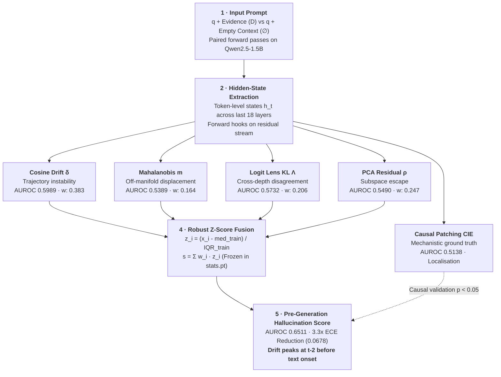

<div align="center">

# Pre-Generation Hallucination Detection<br>via Internal Representation Drift

**Catching RAG hallucinations from a transformer's hidden states: before the first wrong token is emitted.**

[](https://chirudeva-reddy.github.io/NLP-Proj/)
[](https://chirudeva-reddy.github.io/NLP-Proj/#figures)
[](docs/CS_F429_Project_Report.pdf)
[](https://chirudeva-reddy.github.io/NLP-Proj/#bench)
[](https://chirudeva-reddy.github.io/NLP-Proj/#onset)
[](https://huggingface.co/Qwen/Qwen2.5-1.5B)
[](https://www.python.org/)
[](https://pytorch.org/)
[](LICENSE)

<samp>AUROC **0.6511** on RAGTruth held-out test &nbsp;·&nbsp; drift peaks at **t−2** before text onset &nbsp;·&nbsp; **0.6450** zero-shot on HaluEval</samp>

<br><br>

### 🚀 [**Launch the Live Interactive Demo & Figure Exhibition**](https://chirudeva-reddy.github.io/NLP-Proj/)
*Explore real recorded runs from `Qwen2.5-1.5B` token-by-token and inspect mounted research plots right in your browser.*

<br>

[](https://chirudeva-reddy.github.io/NLP-Proj/#console)

<sub>Real recorded runs from `Qwen2.5-1.5B`. The detector's hottest tokens on the fabricated answer are<br>the invented content: <code>1905</code> and <code>Olympic</code>. Click the animation to run the live console.</sub>

</div>

---

## Executive Summary

When a retrieval-augmented generation (RAG) system retrieves relevant documents, it can still generate content completely absent from the source. Traditional detectors only operate **after generation finishes**: employing external LLM judges, token frequency heuristics, or multi-sample logit consistency. These solutions introduce multiple seconds of latency, multiply token costs, and provide zero mechanistic explanation.

**This project addresses a fundamental question:** does the model's internal residual stream already reflect the hallucination before it is written?

By running the generation prompt under two conditions (with retrieved evidence $D$ vs with empty context $\emptyset$), we track internal representation drift across depth. The empirical discovery: **drift peaks at $t-2$, two tokens before the hallucination appears in the generated text** ($p = 2.86 \times 10^{-5}$). This pre-onset gap makes genuine pre-generation intervention possible in a single forward pass.

---

## 🎮 Interactive Web Demo & Visual Showcase

The project includes an interactive web application deployed live on GitHub Pages, featuring native CSS scroll-driven animations, active navigation scroll spy, and GPU-accelerated SVG instrumentation:

🔗 **[https://chirudeva-reddy.github.io/NLP-Proj/](https://chirudeva-reddy.github.io/NLP-Proj/)**

<table>
<tr>
<td width="50%" valign="top">

### 1. [Token-by-Token Playback Console](https://chirudeva-reddy.github.io/NLP-Proj/#console)
* **Real-time generation scrubber:** Scrub forward and backward across decoded tokens at generation pace.
* **Synchronized representation sparkline:** Dynamic SVG trace tracks residual drift position by position.
* **Multi-metric switching:** Inspect individual signals (Cosine, Mahalanobis, Logit Lens, PCA) and their consensus ranking.
* **Keyboard controls:** Press <kbd>Space</kbd> to play/pause, <kbd>←</kbd> / <kbd>→</kbd> to step tokens, and <kbd>1</kbd>–<kbd>5</kbd> to switch test cases.

</td>
<td width="50%" valign="top">

### 2. [Mounted Figure Exhibition Gallery](https://chirudeva-reddy.github.io/NLP-Proj/#figures)
* **Lab-grade figure mounting:** All 7 pipeline plots mounted inside neutral matte exhibition stages with elevation framing.
* **Scroll-driven entrance choreography:** Native CSS `animation-timeline: view()` entrance transitions with staggered fallback.
* **Instant category filtering:** Synchronously filter between *All plots*, *Core findings*, and *Diagnostic traces*.
* **Display modes & lightbox:** Switch between multi-column grid and horizontal scroll stream, or click any figure to open the high-resolution lightbox with 1-click CLI reproduction commands.

</td>
</tr>
<tr>
<td width="50%" valign="top">

### 3. [Pre-Onset Peak Explorer](https://chirudeva-reddy.github.io/NLP-Proj/#onset)
* **Animated trajectory draw:** Interactive SVG curve shows representation drift peaking at **t−2**, two positions prior to the first hallucinated token ($p = 2.86 \times 10^{-5}$).
* **Signal comparison:** Switch between Cosine drift, Mahalanobis distance, Logit Lens, and CIE directly on the chart.

</td>
<td width="50%" valign="top">

### 4. [Dynamic Benchmark Matrix](https://chirudeva-reddy.github.io/NLP-Proj/#bench)
* **Multi-metric column switching:** Toggle across AUROC, Span F1, Spearman ρ, and Expected Calibration Error (ECE).
* **Bootstrap uncertainty bars:** Dynamic SVG whisker bars visualizing 1,000-iteration bootstrap confidence intervals with chance baselines.

</td>
</tr>
<tr>
<td width="50%" valign="top">

### 5. [Drift Reader Experience](https://chirudeva-reddy.github.io/NLP-Proj/#drift)
* **Real-time representation heatmapping:** Words illuminate as you scroll: cold where representations stay on the faithful manifold, hot where they depart.
* **Side-by-side evidence tracking:** Direct comparison against the retrieved source passage with live peak metric counters.

</td>
<td width="50%" valign="top">

### 6. [Active Nav & Full Responsiveness](https://chirudeva-reddy.github.io/NLP-Proj/)
* **Scroll spy header:** Dynamically tracks viewport position with vermilion indicators.
* **Zero horizontal overflow:** Verified 100% responsive across mobile, tablet, and desktop viewports (360px–1280px).

</td>
</tr>
</table>

---

## Interactive Architecture & Pipeline

The prompt executes twice: once with retrieved evidence, once with empty context. The difference in internal state evolution provides the detection signal.

### 1. Interactive Flowchart (Click any block to inspect)



<div align="center">

[](https://chirudeva-reddy.github.io/NLP-Proj/#signals)

<sub><b>Click the diagram</b> to open the live interactive console on GitHub Pages.</sub>

</div>

> **Note on the "5 signals":** Four representation signals are fused into the frozen composite shipped in `stats.pt`. **CIE is computed per token for causal localisation, not fusion** (`composite_features` in the configuration specifies four features).

---

## The Five Internal Drift Signals

<table>
<tr><th width="24%">Signal</th><th width="42%">What It Measures</th><th width="34%">Mathematical Formulation</th></tr>

<tr><td><b>1 · Cosine Drift</b><br><code>δ⁽ˡ⁾ₜ</code><br><sub>AUROC 0.5989 · w 0.383</sub></td>
<td>Trajectory instability: angular rotation of the residual stream between consecutive answer positions. Grounded continuations evolve smoothly; fabrications make discontinuous angular jumps.</td>
<td>

$$\delta_t^{(\ell)} = 1 - \frac{h_t^{(\ell)} \cdot h_{t-1}^{(\ell)}}{\lVert h_t^{(\ell)} \rVert_2 \; \lVert h_{t-1}^{(\ell)} \rVert_2}$$

</td></tr>

<tr><td><b>2 · Mahalanobis</b><br><code>m⁽ˡ⁾ₜ</code><br><sub>AUROC 0.5389 · w 0.164</sub></td>
<td>Off-manifold displacement from the empirical distribution of faithful tokens. Mean vector $\mu$ and covariance $\Sigma$ are estimated <b>strictly on the training split</b>.</td>
<td>

$$m_t^{(\ell)} = \sqrt{(h_t^{(\ell)} - \mu_\ell)^\top \Sigma_\ell^{-1} (h_t^{(\ell)} - \mu_\ell)}$$

</td></tr>

<tr><td><b>3 · Logit Lens KL</b><br><code>Λ⁽ˡ⁾ₜ</code><br><sub>AUROC 0.5732 · w 0.206</sub></td>
<td>Cross-depth disagreement: projects intermediate layers directly through the unembedding matrix $W_U$ and measures KL divergence between distributions with evidence vs without it.</td>
<td>

$$\Lambda_t^{(\ell)} = D_{\text{KL}}\Big(\hat{P}_t^{(\ell)}(\mathcal{D}) \;\big\Vert\; \hat{P}_t^{(\ell)}(\emptyset)\Big)$$

</td></tr>

<tr><td><b>4 · PCA Residual</b><br><code>ρ⁽ˡ⁾ₜ</code><br><sub>AUROC 0.5490 · w 0.247</sub></td>
<td>Energy escaping outside the 16-component principal subspace spanned by faithful activations. Captures orthogonal directional departures rather than scaled variance.</td>
<td>

$$\rho_t^{(\ell)} = \Big\lVert h_t^{(\ell)} - V_\ell V_\ell^\top h_t^{(\ell)} \Big\rVert_2$$

</td></tr>

<tr><td><b>5 · Causal IE</b><br><code>CIE(c)</code><br><sub>AUROC 0.5138 · Localisation</sub></td>
<td>Direct causal intervention: swaps activations between faithful and hallucinated forward passes in both directions, measuring shifts in target-token generation probability.</td>
<td>

$$\text{CIE}(c) = P_{\mathcal{M}}^{\text{patch}(c)}(y_t^{\ast}) - P_{\mathcal{M}}^{\text{corrupt}}(y_t^{\ast})$$

</td></tr>
</table>

---

## Benchmark Results

<div align="center">

**RAGTruth held-out test split · 2,655 responses · 38.9% hallucination rate · 1,000-iteration bootstrap CIs**

</div>

| Detector | AUROC ↑ | 95% Bootstrap CI | F1 Span ↑ | Spearman ρ ↑ | ECE ↓ |
| :--- | :---: | :---: | :---: | :---: | :---: |
| Attention Entropy *(baseline B1)* | 0.6106 | [0.5891, 0.6318] | 0.5351 | 0.1869 | 0.2230 |
| Logit Confidence *(baseline B2)* | 0.5497 | [0.5274, 0.5716] | 0.4737 | 0.0839 | 0.1249 |
| Cosine Drift | 0.5989 | [0.5772, 0.6201] | 0.5181 | 0.1670 | 0.0472 |
| Mahalanobis Distance | 0.5389 | [0.5168, 0.5612] | 0.4528 | 0.0657 | 0.0814 |
| Logit Lens Divergence | 0.5732 | [0.5510, 0.5954] | 0.4836 | 0.1237 | 0.1112 |
| PCA Deviation | 0.5490 | [0.5269, 0.5711] | 0.4437 | 0.0828 | 0.0778 |
| CIE (Top-3 Layers) | 0.5138 | [0.4916, 0.5360] | 0.4286 | 0.0233 | 0.0824 |
| **✨ Full Composite Detector** | **0.6511** | **[0.6307, 0.6614]** | **0.5548** | **0.2553** | **0.0678** |

> **Production Context for Technical Recruiters & Engineers:**
> An AUROC of 0.6511 is a validated single-pass mechanistic signal. It delivers **+0.0405 AUROC** over attention-entropy, a **3.3× reduction in calibration error** (0.2230 down to 0.0678), and closes **19.51%** of the performance gap to multi-pass ReDeEP (0.82) : all from a **single forward pass of a lightweight 1.5B model** with 0 API sampling overhead. [Explore the interactive benchmark table →](https://chirudeva-reddy.github.io/NLP-Proj/#bench)

---

## In-Depth Experimental Analyses

<details open>
<summary><b>🕐 Pre-onset temporal precedence (E4) : The core discovery</b></summary>
<br>

Aligning every hallucinated span at its initial hallucinated token ($t = 0$) and evaluating leading tokens, cosine drift peaks at **$t-2$** (Mann–Whitney U test, $p = 2.86 \times 10^{-5}$). 

The transformer's internal representations leave the faithful manifold two tokens prior to committing the erroneous content to text, providing the physical window required for early pre-emption.

| Token Offset | Cosine Drift δ | Mahalanobis m | Logit Lens Λ | Spearman ρ | CIE |
| :---: | :---: | :---: | :---: | :---: | :---: |
| t−3 | 0.2668 | 37.9664 | 3.6684 | 87.4574 | 37.7385 |
| **t−2 (peak)** | **0.2872** | 34.0917 | 3.5820 | 80.0704 | 35.6801 |
| t−1 | 0.2821 | 31.4590 | **4.2375** | 72.2008 | 31.7477 |
| t (onset) | 0.2729 | 36.5722 | 3.8713 | 85.6095 | 36.3971 |
| t+1 | 0.2708 | **38.1772** | 3.5158 | **88.1041** | 38.2783 |

<div align="center">

<br>
<sub>🔍 <a href="https://chirudeva-reddy.github.io/NLP-Proj/#figures"><b>Inspect the mounted E4 figure in the live gallery</b></a> · 1-click CLI reproduction and lightbox inspection</sub>
</div>

</details>

<details>
<summary><b>🎯 Causal localisation via bidirectional patching (E3)</b></summary>
<br>

Across 50+ paired counterfactual examples, activation states were swapped between faithful and hallucinated executions in both directions. Early self-attention layers dominate causal influence by an order of magnitude, with every component group passing statistical significance at $p < 0.05$.

| Component Group | Depth Range | CIE (f → h) | CIE (h → f) | Significance |
| :--- | :---: | :---: | :---: | :---: |
| **Early Attention** | 1–25% | **−1.0991** | **−1.0782** | ✅ $p < 0.05$ |
| Mid FFN | 26–75% | −0.0550 | −0.0299 | ✅ $p < 0.05$ |
| Late FFN | 76–100% | −0.2732 | −0.1608 | ✅ $p < 0.05$ |
| Copying Heads | last 25% | −0.0807 | −0.0358 | ✅ $p < 0.05$ |

<div align="center">

<br>
<sub>🔍 <a href="https://chirudeva-reddy.github.io/NLP-Proj/#figures"><b>Inspect the mounted E3 figure in the live gallery</b></a> · 1-click CLI reproduction and lightbox inspection</sub>
</div>

</details>

<details>
<summary><b>🌍 Zero-shot cross-domain transfer to HaluEval (E5)</b></summary>
<br>

The frozen composite model (trained weights, medians, and IQRs unchanged) was applied directly to HaluEval-QA without retraining. The composite score demonstrates remarkable domain stability ($+0.0058$ AUROC delta), whereas individual standalone signals exhibit high variance.

| Detector | RAGTruth AUROC | HaluEval AUROC | Δ (RAGTruth − HaluEval) | Behaviour |
| :--- | :---: | :---: | :---: | :--- |
| **Full Composite** | **0.6508** | **0.6450** | **+0.0058** | **Stable & Robust** |
| Cosine Drift | 0.6244 | 0.8345 | −0.2102 | Transfers upward |
| Mahalanobis Distance | 0.5190 | 0.7006 | −0.1815 | Transfers upward |
| Logit Lens Divergence | 0.5917 | 0.4337 | +0.1580 | Domain sensitive |
| PCA Residual Deviation | 0.5764 | 0.7186 | −0.1421 | Transfers upward |

</details>

<details>
<summary><b>🧱 Layer localisation, component drift & failure traces (E2, E6, E7)</b></summary>
<br>

Point-biserial correlation across all 28 Qwen layers indicates discriminative signal heavily concentrates in layers 15 through 25. The top three predictive layers identified are **21, 23, and 22**.

<div align="center">

</div>

Decomposing the residual updates into self-attention vs FFN sub-layers shows FFN key-value memories driving late-stage drift:

<div align="center">

</div>

Deterministic failure traces:

| False Negative (#1289) | False Positive (#12310) | Metric Disagreement (#3574) |
| :---: | :---: | :---: |
|  |  |  |

<div align="center">
<br>
<sub>🔍 <a href="https://chirudeva-reddy.github.io/NLP-Proj/#figures"><b>Inspect all 7 plots and failure traces in the live figure exhibition</b></a></sub>
</div>

</details>

---

## Quickstart & Live Scoring CLI

Clone the repository and install requirements:

```bash
git clone https://github.com/Chirudeva-Reddy/NLP-Proj.git && cd NLP-Proj
python3 -m venv .venv && source .venv/bin/activate
pip install -r Requirements.txt
```

Score any context and answer pair locally using the pre-fitted weights in `stats.pt`:

```bash
python NLP-sub/scripts/live_demo.py --profile local \
  --input-file NLP-sub/examples/live_demo_inputs/eiffel_tower_hallucinated_passage.json \
  --show-aggregates
```

<details>
<summary><b>View Sample Output</b> : Suspicious-token ranking and sample aggregates</summary>
<br>

```text
Consensus suspicious-token ranking
rank | idx | token         | consensus | mahalanobis | logit_lens | pca_deviation
-----+-----+---------------+-----------+-------------+------------+--------------
   1 |  18 | <sp>the       |    0.9206 |     75.3978 |     9.6270 |      124.8376
   2 |  14 | 9             |    0.8095 |     79.2931 |     4.8447 |      132.1120
   3 |  15 | 0             |    0.8095 |     72.6667 |     7.6290 |      116.7789
   4 |  19 | <sp>Olympic   |    0.7937 |     69.3927 |     6.0547 |      127.3764
   5 |  13 | 1             |    0.7302 |     68.6997 |     5.4883 |      123.5343

Aggregate scores (max)
composite            0.4305
```

The top flagged tokens isolate the fabricated year **1905** and invented event **Olympic Games** : content entirely unsupported by the ground-truth document.

</details>

Score your own custom prompts by passing a JSON file:

```json
{
  "instruction": "Use only the retrieved context to produce the answer.",
  "context": "Alexander Fleming discovered penicillin in 1928. Penicillin began being used clinically around 1941.",
  "passage": "Penicillin was discovered by Alexander Fleming, and it began being used clinically around 1941."
}
```

*(Omit the `"passage"` key to prompt the model to generate its own answer before scoring its internal state).*

---

## Full Reproduction Runbook

<details open>
<summary><b>Step 1 : Sequential 4-Stage Pipeline</b></summary>
<br>

```bash
# 1 · Run forward passes and generate float16 hidden-state artifacts
python NLP-sub/pipeline/1-infer.py --model Qwen/Qwen2.5-1.5B --layers last18 --device auto \
  --output-dir NLP-sub/outputs/artifacts

# 2 · Fit μ, Σ, and PCA basis V on TRAIN split only, freeze composite weights
python NLP-sub/pipeline/2-fit.py --artifacts-dir NLP-sub/outputs/artifacts \
  --output NLP-sub/outputs/stats.pt --pca-components 16

# 3 · Score the held-out test split with the frozen parameters
python NLP-sub/pipeline/3-score.py --artifacts-dir NLP-sub/outputs/artifacts \
  --stats NLP-sub/outputs/stats.pt --output-dir NLP-sub/outputs/scores_test --split test

# 4 · Compute AUROC, F1, Spearman ρ, ECE with 1,000 bootstrap iterations
python NLP-sub/pipeline/4-eval.py --scores-dir NLP-sub/outputs/scores_test \
  --aggregate max --n-boot 1000
```

</details>

<details>
<summary><b>Step 2 : Experiments E2 through E8</b></summary>
<br>

```bash
# E2 · Per-layer AUROC profiling
python NLP-sub/pipeline/plot.py --artifacts-dir NLP-sub/outputs/artifacts/test \
  --stats NLP-sub/outputs/stats.pt --output docs/images/layer_profile.png

# E3 · Bidirectional activation patching
python NLP-sub/scripts/e3_patching.py --model Qwen/Qwen2.5-1.5B --device auto \
  --output-dir NLP-sub/outputs/e3

# E4 · Pre-onset temporal precedence evaluation
python NLP-sub/scripts/e4_temporal.py

# E5 · Zero-shot HaluEval transfer benchmark
python NLP-sub/scripts/e5_halueval.py --model Qwen/Qwen2.5-1.5B-Instruct --layers last18 --device auto \
  --stats NLP-sub/outputs/stats.pt --qa-json dataset/halueval/qa_data.json \
  --artifacts-dir NLP-sub/outputs/halueval_artifacts --scores-dir NLP-sub/outputs/halueval_scores \
  --ragtruth-scores-dir NLP-sub/outputs/scores_test

# E6 · Self-attention vs FFN component drift
python NLP-sub/scripts/e6_component_drift.py --model Qwen/Qwen2.5-1.5B --device auto \
  --artifacts-dir NLP-sub/outputs/artifacts/test --output-dir NLP-sub/outputs/e6

# E7 · Failure-case qualitative traces
python NLP-sub/scripts/e7_failures.py --model Qwen/Qwen2.5-1.5B --device auto \
  --scores-dir NLP-sub/outputs/scores_test --stats NLP-sub/outputs/stats.pt \
  --e6-json NLP-sub/outputs/e6/component_drift.json --output-dir NLP-sub/outputs/e7

# E8 · SOTA gap comparison with ReDeEP and LUMINA
python NLP-sub/scripts/e8_sota_gap.py --scores-dir NLP-sub/outputs/scores_test \
  --aggregate max --output-dir NLP-sub/outputs/e8
```

</details>

<details>
<summary><b>Step 3 : Rebuilding the GitHub Pages Demo Site</b></summary>
<br>

The static demo site located in `docs/` is served via GitHub Pages. It dynamically loads `docs/site/demo_runs.json`, generated by scoring input cases:

```bash
cd NLP-sub
python scripts/export_demo_json.py --stats outputs/stats.pt --output ../docs/site/demo_runs.json

# Local preview
cd ../docs && python3 -m http.server 8000
```

</details>

---

## Repository Structure

```text
NLP-Proj/
├── README.md                      # Primary project overview & documentation
├── Requirements.txt               # Python package dependencies
├── METRICS_VIVA.md                # Viva defense reference: derivations & logic
├── docs/
│   ├── index.html                 # Interactive GitHub Pages portfolio site
│   ├── site/demo_runs.json        # Pre-computed scoring runs for the web console
│   ├── CS_F429_Project_Report.pdf # Formal academic research report (14 pages)
│   ├── PIPELINE_RUNBOOK.md        # Pipeline execution instructions
│   └── images/                    # Figures, architecture diagrams, and traces
└── NLP-sub/
    ├── COMPREHENSIVE.md           # Deep codebase architecture guide
    ├── pipeline/                  # 1-infer · 2-fit · 3-score · 4-eval · plot
    ├── src/
    │   ├── dataset.py             # Grouped train/val/test split generator
    │   ├── inference.py           # Forward hook registration & hidden extraction
    │   ├── metrics.py             # Mathematical implementations of 5 drift signals
    │   ├── scoring.py             # Robust z-score composite scoring engine
    │   ├── evaluate.py            # Evaluation metrics (AUROC, F1, Spearman, ECE)
    │   ├── component_outputs.py   # Activation replay hooks for FFN/attention
    │   └── halueval.py            # HaluEval dataset integration
    ├── scripts/                   # Experiments E3-E8, live demo, and export
    ├── examples/live_demo_inputs/ # Pre-formatted input test scenarios
    └── outputs/                   # Cached artifacts, stats.pt, scores (git-ignored)
```

---

## Key Documentation & Links

| Resource | Scope & Purpose |
| :--- | :--- |
| 🌐 **[Live Interactive Demo](https://chirudeva-reddy.github.io/NLP-Proj/)** | Online token-by-token scoring console with real model activations |
| 📊 **[Figure Exhibition Gallery](https://chirudeva-reddy.github.io/NLP-Proj/#figures)** | Mounted research plots with scroll reveals, category filters, and lightbox |
| 📄 **[Research Paper (14 Pages, PDF)](docs/CS_F429_Project_Report.pdf)** | Formal 14-page manuscript: theoretical basis, protocol, contributions, and signed contribution statement |
| 📖 **[Pipeline Runbook](docs/PIPELINE_RUNBOOK.md)** | Comprehensive CLI reference, flag specifications, parameter tuning |
| 🛡️ **[Viva Defense Notes](METRICS_VIVA.md)** | Mathematical proofs, component failure analysis, viva Q&A |
| 📚 **[Codebase Architecture](NLP-sub/COMPREHENSIVE.md)** | Source code deep-dive and modular breakdown |

---

## Authors & Acknowledgments

**CS F429 Natural Language Processing** · BITS Pilani, Dubai Campus  
Supervised by **Prof. Elakkiya Rajasekar** · May 2026

| Author | Student ID | Core Contribution Area |
| :--- | :---: | :--- |
| **Sanya Wadhawan** | `2023A7PS0296U` | Methodology design, dataset processing, RAGTruth pipeline |
| **Chirudeva Reddy** | `2023A7PS0331U` | Experimental architecture, composite metric fusion, causal patching |
| **Yusra Hakim** | `2022A7PS0004U` | Related work synthesis, mechanistic interpretability review |
| **Joseph Cijo** | `2022A7PS0019U` | Baseline implementations, result benchmarking, documentation |

---

## Citation

```bibtex
@techreport{wadhawan2026pregen,
  title       = {Pre-Generation Hallucination Detection via Internal Representation Drift},
  author      = {Wadhawan, Sanya and Reddy, Chirudeva and Hakim, Yusra and Cijo, Joseph},
  institution = {BITS Pilani, Dubai Campus},
  course      = {CS F429: Natural Language Processing},
  year        = {2026},
  month       = {May},
  url         = {https://github.com/Chirudeva-Reddy/NLP-Proj}
}
```

<div align="center">
<br>
<sub>Built for NLP research at BITS Pilani, Dubai Campus · MIT Licensed</sub>
<br><br>
<a href="https://chirudeva-reddy.github.io/NLP-Proj/"><b>▶ Open the Live Interactive Demo</b></a> &nbsp;·&nbsp; <a href="docs/CS_F429_Project_Report.pdf"><b>📄 Read the Research Paper (14 Pages, PDF)</b></a>
</div>
